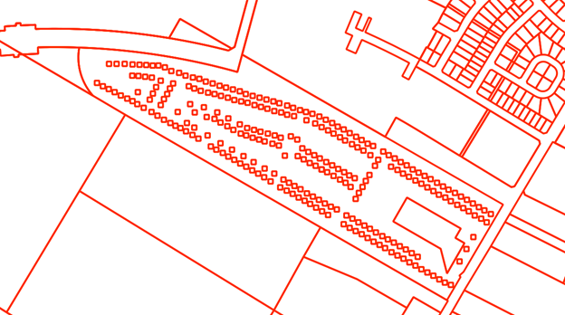

Step 1: Data Preparation
===================================

.. contents:: Contents:
   :depth: 4

There are three key layers that must be injested, cleaned, and prepped before matching can begin.
The composition of these input files varies widely by jurisdiction so to a certain degree this process
will vary slightly from region to region in order to compensate for these differences. These three layers
are:

* Building Polygons
* Address Points
* Parcel Fabric

.. Note::
   **Building Polygons** is the term used to describe the building data rather than the more commonly used building footprints.
   The primary reason for this difference is that a building footprint might only conform to the roof area of a building whereas
   a building polygon should encompass the entire area of a structure.  

All three of these layers must be available in order to to create address to building matches under the
current process. Intially all three layers are loaded into geodataframes for cleaning. 

.. code-block:: python
   
   # Load the key datasets into geodataframes
   # linking_data == parcel_fabric
   linking_data = gpd.read_file(linking_data_path, layer=linking_lyr_nme, linking_ignore_columns=linking_ignore_columns, mask=aoi_gdf)
   addresses = gpd.read_file(ap_path, layer=ap_lyr_nme, mask=aoi_gdf)
   footprint = gpd.read_file(footprint_lyr, layer=footprint_lyr_name ,mask=aoi_gdf)

The following stections describe the individual processes used to clean the three key datasets.

Parcel Fabric Cleaning
----------------------

The following  cleaning/preparation processes are applied to the raw parcel data in order to 
prepare for matching:

* Micro Parcel detection/removal
* Linkage field selection/calculation

Micro Parcel Detection/Removal
______________________________

Micro parcels are small parcels with an area smaller than 100m2. These parcels are most often located in 
trailer parks and condo developments. These only conplicate the matching process when included and are
therefore removed during the cleaning phase.

In the image above the there are many micro parcels in a single much larger parcel. In general these parcels have an
area of >100m2 and so can easily be filtered out using the follwing code:

.. code-block:: python

   linking_data['AREA'] = linking_data['geometry'].area
   linking_data = linking_data[linking_data['AREA'] > 101]

Linkage Field Selection/Calculation
___________________________________

The linkage field is a field in the parcel fabric that will be used when joining the parcels to the address points
and the building polygons. If a viable option exists then it is possible to use a pre-existing field from the dataset.
However, it needs to meet certain criteria:

* There must be no NULL values 
* There must be a unqiue value for every record with no repetitions

If no viable field exists in the base data then a new field can be calculated. This in its simplest form is a unique 
integer value for each parcel. More complex processes are available if retaining the value for use after matching however, 
in this documentation we will be using a simple unique integer for example purposes. 

.. code-block:: python

   linking_data['link_field'] = range(1, len(linking_data.index)+1)

Address Points Cleaning
-----------------------

The following  cleaning/preparation processes are applied to the raw address point data in order to 
prepare for matching:

* Parcel Linkage

Parcel Linkage for Address Points
_________________________________

Parcel linkage is the process of adding the linking field for a parcel to the a record if that record intersects that parcel.
There are couple criteria for this. 

1. There can only be one linkage between parcel data and the address points. In cases where 
   the address point intersects multiple parcels use the polygon with the smaller area. The 
   polygon with the smaller area is more likely to coorespond to a lot rather than a whole 
   property. For example there are often cases where a lot for a condo townhouse is within the
   parcel for the entire development. In that case we want to grab the smaller parcel as the results
   are more likely to be accurate after matching.

   .. image:: img/
      :width: 400
      :alt: Layered Parcels Example

Building Polygon Cleaning
-------------------------

The following  cleaning/preparation processes are applied to the raw building polygon data in order to 
prepare for matching:

* Parcel Linkage
* Non-Addressable Outbuilding Detection

Parcel Linkage for Building Polygons
____________________________________

Parcel Linkages are made similar to the way they are made for address points with minor changes in workfolow.

* Building polygons are converted to representative points to allow for the creation of the spatial jurisdiction
* If a building intersects more than one polygon then the smallest acceptable polygon is taken as the linkage.

**Representative Point** A representative point is an arbitrary points within a polygon. The key feature of this point is 
that it will always be contained within the bounds of a polygon regardless of complexity. This is different from a centroid
which is always located at the centre of the polygon regardless of if it actually sits within the bounds of that polygon or not.

Non-Addressable outbuilding detection
_____________________________________

A building is considered to be a non Non-Addressable outbuilding when one or more of the following criteria are met:

1. The footprint has an area of less than 50m2 and there is at least one other building greater than 50m2 in the same parcel,
2. The area of the building is between 50m2 and 100m2 and the number of buildings is greater than the number of address points in the parcel
   To perform this process the following steps are followed:
   
   * Use groupby to get the counts of address points and building polygons for each parcel
   * Use 

   The above steps are organized into a function which is then run on groups of buildings organized by the linking parcel. The funtions and the code to properly call it can be seen below.
   .. code-block:: python
      
      def find_sheds( bf_data, ap_count, bf_area_field='bf_area', bf_index_field='bf_index', bp_threshold=20, min_adressable_area=50, max_shed_size=100):
         '''
         returns a list of all bf_indexes that should be flagged as sheds and should be considered unaddressable.
         take the difference from the counts of each type of record in the parcel and flag the number of smallest
         buildings that coorespond with the difference value
         '''
         bf_count = len(bf_data)
         
         # If either is equal to zero this method will not help select out sheds
         if ap_count == 0 or bf_count == 0:
               return []
         if bf_count == 1:
               return []

         # Sizing is different in trailer parks so deal with these differently
         if bf_count > bp_threshold:
               # do just the tiny building check as the min max between home and shed in these areas overlaps
               sheds = bf_data.loc[bf_data[bf_area_field] < min_adressable_area]
               shed_indexes = sheds[bf_index_field].values.tolist() # convert to list of indexes
               return shed_indexes

         # Take out the tiny buildings under 50m2 and prelabel them as sheds then take remainder and test count vs count
         sheds = pd.DataFrame(bf_data.loc[bf_data[bf_area_field] < min_adressable_area])
         bf_data = bf_data.loc[(bf_data[bf_area_field] > min_adressable_area)]

         bf_count = len(bf_data) # reset bf_count because we changed the # of buildings in bf_data

         ap_bf_diff = bf_count - ap_count # how many more bf's there are than address points in the parcel
         sheds = pd.concat([sheds, bf_data.sort_values(bf_area_field, ascending=True).head(ap_bf_diff)], axis=0, join='outer') # sort the smallest to the top then take the top x rows based on ap_bf_diff value 
         
         sheds = sheds[sheds[bf_area_field] <= max_shed_size] # remove things from the output that are unlikly to be sheds >= 100m2

         shed_indexes = sheds[bf_index_field].values.tolist() # convert to list of indexes
         return shed_indexes

3. The building is determined exceed the acceptable threshold of roundness. The roundness of the building is determined using the following formula:
   
   .. math::
      
      (4 * pi * Area) / (Perimiter * Perimiter)

   Should a building have a roundness of >= 0.98 then it is classified as a Non-Addressable Outbuilding. The steps for this process are as follows:

   * Caculate the area and perimiter of the building polygon in separate variables within the building polygons geodataframe.
   * Create a new field called 'C' in the buildings geodataframe and calculate circularity using the formula above.
   * Flag and extract all records that exceed the threshold for roundness. Remove them from the main building polygon geodataframe.
   
   An example of how this process is conducted in the code can be seen below:
  
   .. code-block:: python
   
      # Start by finding all the perfectly round buildings and labelling them as sheds size doesn't matter here.
      footprint_gdf['perimiter'] = footprint_gdf['geometry'].apply(lambda x: round(x.length, 2))
      footprint_gdf['C'] = footprint_gdf.apply(lambda c: (4*pi*c['bf_area'])/(c['perimiter']*c['perimiter']), axis=1)
      # separate out the round sheds from rest of the 
      round_sheds = footprint_gdf[footprint_gdf['C'] >= 0.98]
      footprint_gdf = footprint_gdf[footprint_gdf['C'] < 0.98]
      footprint_gdf.drop(columns=['C'], inplace=True)
      round_sheds.drop(columns=['C'], inplace=True)
