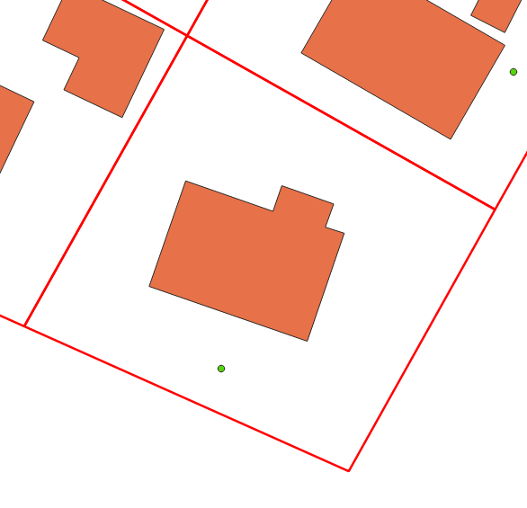
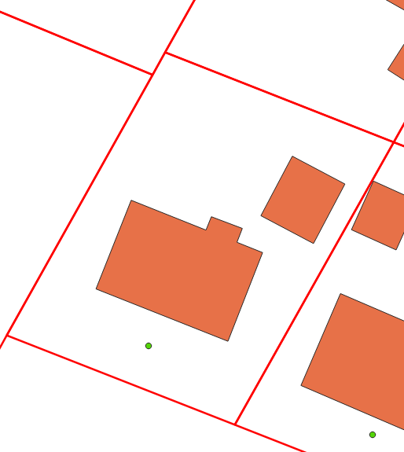
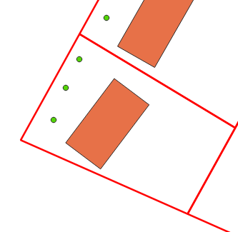
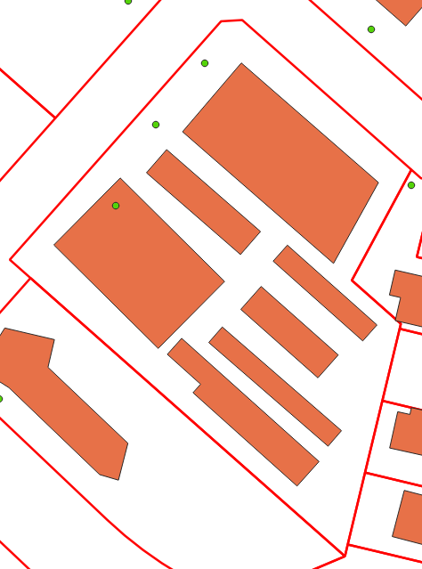
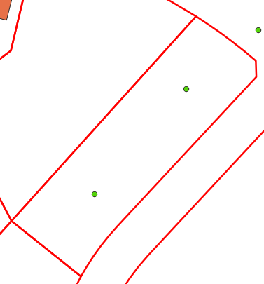

Step 2: Parcel Relationship Calculation
=======================================

.. toctree::
   :maxdepth: 2
   :hidden:

Once cleaned the data's relationship to the parcel data must be calculated. This relationship
is based on the count of address points and building footprints contained in a given parcel.
This page describes the different relationship types and then shows how they are calculated
within the matching scripts.

Relationship Types
==================
One to One
----------

The most basic relationship type where in a given single parcel there is only one address point 
and one building footprint.

One to Many
-----------

In this relationship type there is one address point but many building footprints contained in a
single parcel.

Many to One
-----------

In this relationship there are many address points and a single building footprint contained in a
single parcel

Many to Many
------------

This is the most complicated relationship type where more than one address point and more than one
building footprint are contained in a single parcel.

No Linked Building
------------------

This relationship is assigned to address points in cases where one or more are present in a parcel but no building footprint is present.

Unlinked
--------

This relationship is assigned to address points and building polygons when no underlying parcel is present. This can be data in a region that
does not have a parcel fabric available or data within the extent of a parcel fabric that falls into a gap or area with no polygons.

.. Note:: Note
   While some methods have been looked at to deal with regions without an available parcel fabric to date none has proven to be as effective at 
   creating accurate matches as a parcel fabric from an authoritative.

Relationship Calculation Process
--------------------------------

The code that calculates the relationship for each address point and building polygon goes through the following steps:

1. The address point and building polygon data were linked during the address cleaning phase. These cleaned datasets are loaded into geodataframes.
2. Using pandas groupby functionality both the address points and building polygons are grouped by the parcel linkage field to get counts of each for every parcel ID. Note that building classified as non-addressable outbuildings are not included in these counts.
3. The parcel relationship is then calculated based off of the counts created in step 2. These values are assigned to the address points
4. The address data is exported to the project geopackage.

.. code-block:: python
  
  def relationship_setter(parcel_ident, ap_parcel_counts, bf_parcel_counts):
      '''Returns the parcel relationship type for the given record based on the counts of the parcel linkages in the bf and ap datasets'''

      if isnan(parcel_ident):
         return 'unlinked'
      bf_indexes = bf_parcel_counts.index.tolist()
      if not parcel_ident in bf_indexes: 
         return 'no_linked_building'
      ap_count = ap_parcel_counts[ap_parcel_counts.index == parcel_ident].tolist()[0]
      bf_count = bf_parcel_counts[bf_parcel_counts.index == parcel_ident].tolist()[0]
      if (ap_count == 1) and (bf_count == 1):
         return 'one_to_one'
      if (ap_count == 1) and (bf_count > 1):
         return 'one_to_many'
      if (ap_count > 1) and (bf_count == 1):
         return 'many_to_one'
      if (ap_count > 1) and (bf_count > 1):
         return 'many_to_many' 
      else:
         print(ap_count)
         print(bf_count)
         sys.exit()  
   
   # Load in datasets
   addresses = gpd.read_file(ap_path, layer=ap_lyr_nme, mask=aoi_gdf)
   footprints = gpd.read_file(bf_path, layer=bf_lyr_nme, mask=aoi_gdf)
   
   # Ensure the CRS of the data is consistent
   footprints.to_crs(crs=proj_crs, inplace=True)
   addresses.to_crs(crs=proj_crs, inplace=True)

   grouped_ap = addresses.groupby('link_field', dropna=True)['link_field'].count()
   grouped_bf = footprints[footprints['shed_flag'] == False].groupby('link_field', dropna=True)['link_field'].count()
   addresses['parcel_rel'] = addresses['link_field'].apply(lambda x: relationship_setter(x, grouped_ap, grouped_bf))

   # Export the addresses dataset with the new field
   addresses.to_file(output_gpkg, layer='ap_full', driver='GPKG')