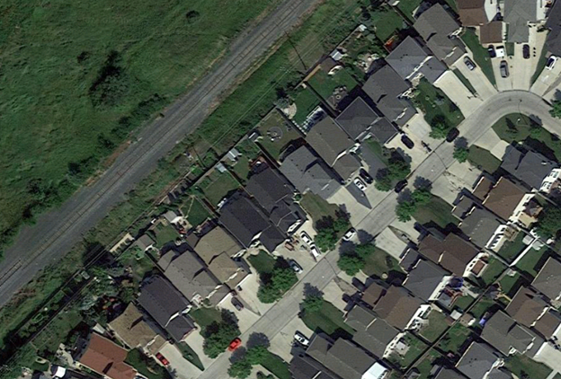
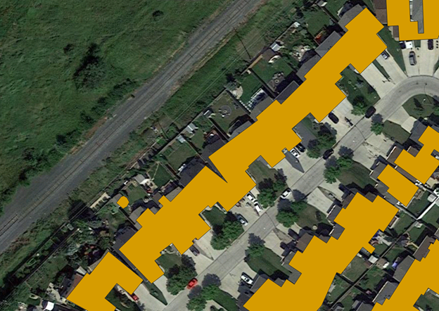
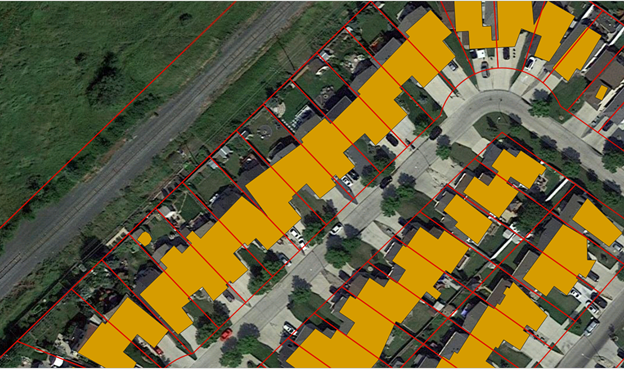
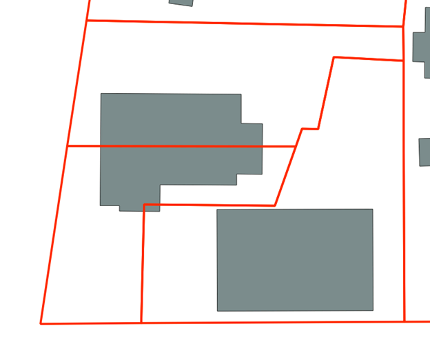
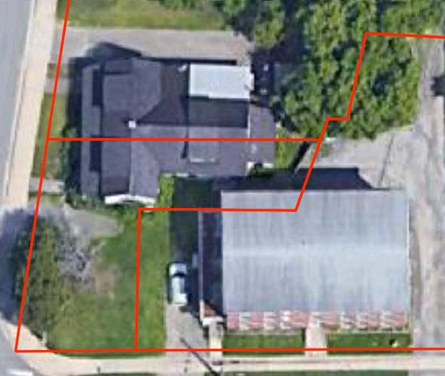

Polygon Splitting
=================

.. toctree::
   :maxdepth: 2
   :hidden:

As sources of building data were compiled for the NBL it became appearent that there were significant differnces in the data quality between each source. 
Buildings that were close together in some sources were clumped into a single polygon. This had significant implications for the accuracy of
matching process. As seen in the first image below out area of interest has a row of single family detached homes
which while relatively close together should be individual polygons in a building layer.

However that is not what we see in the data. As seen in the image below this area is clumped into long single polygons
that are not representative of what exists on the ground. 

Another existing issue is that during the address matching process buildings that cross a parcel boundary with a valid match on either side of that boudary would
return wildly different confidence results depending on the where

As things stand performing the matching process on clumped building polygons and cross boundary polygons  would produce inaccurate results. In order to 
improve these results an additional method had to be developed.

Method Overview
---------------

All code samples in this section are pulled from the scripts/polygon_cutter.py script found in the github repo. All samples are subject to change as this project is in
active development.

As seen below there is a ready made geometry available for dealing with the clumped buildings. A parcel fabric when placed over the building polygons appears to intersect 
the underlying geometry close to where the gap should exist between the buildings. While not perfect using the parcel fabric to split the building polygons offers a
significant improvement over what exists now. 

The parcel fabric is used as a guide and cut any building polygons that cross its boundary geometry using the following steps:

1. Convert parcel fabric from polygons to lines.
2. If a polygon intersects one or more of these lines then split the polygon along those lines.
3. Analyze the results and determine if the split results in two or more valid buildings. Remove all slivers and invalid polygons.

Process Overview
----------------

Step 1: Cut Geometry Data Preperation
_____________________________________

The first step is to convert the parcel fabric from polygons to lines. This is required as in order to split the polygons accurately the smallest common geometry must be used
This is done using the following process:

1. Geometry is validated using the below function to repair any invalid geometries.
   
   .. code-block:: python

      def ValidateGeometry(input_geometry) -> gpd.GeoSeries:
         '''Checks if input geometry is valid and if invalid attempts to make it valid accepts Geodataframes and Geoseries'''
         if type(input_geometry) == gpd.GeoSeries:
               input_geometry = input_geometry.apply(lambda geom: make_valid(geom))
         if type(input_geometry) == gpd.GeoDataFrame:
               input_geometry = input_geometry['geometry'].apply(lambda geom: make_valid(geom) if not geom.is_valid else geom)
         return input_geometry

2. To maintain efficiency all non essential geometry are dropped from the cut_geom at this stage. This is done using two filters the first of which 
   filters out all cut geometry that does not intersect any of the building polygons.

   .. code-block:: python 
      
      # Drop Non-Essential Cut Geometry
        cut_joined = gpd.sjoin(cut_geom, self.bp[['bp_index', 'geometry']])
        cut_joined = list(set(cut_joined[~cut_joined['bp_index'].isna()]['cut_index'].tolist()))
        cut_geom = cut_geom[cut_geom['cut_index'].isin(cut_joined)]
   
   The second filter is only run if the optional point_data input is used and removes all cut geometry that does not intersect a point. The intended input here is a layer containing
   civic addresses. Ensure that only data where the location of the point in placed by an authoritiative source (municipality, province) as inaccurate point locations could cause necessary
   data to be filtered out at this stage.
   
   .. code-block:: python
      
      if type(point_data) != None:

            point_data.to_crs(crs=crs, inplace=True)
            point_data['ap_index'] = range(1, len(point_data.index) + 1)
            cut_joined_ap = gpd.sjoin(cut_geom, point_data[['ap_index', 'geometry']])
            cut_joined_ap = list(set(cut_joined_ap[~cut_joined_ap['ap_index'].isna()]['cut_index'].tolist()))
            cut_geom = cut_geom[cut_geom['cut_index'].isin(cut_joined_ap)]

3. The geometry is then checked for type and converted into lines if necessary using the following process:

   a. If the input geometry is not a LineString or MultiLineString and is a Polygon or Multipolygon then convert it to lines using .boundary.
   b. .boundary return the boundary as a single line. Break this up so that each side is a single record per side.
   c. The above steps create significant number of duplicated lines filter the duplicated geometries to prevent duplication
    
   .. code-block:: python
      
      def ToSingleLines(geom: shapely.geometry) -> MultiLineString:
            '''Converts polygons into single lines'''
                
            def MultiLineDevolver(m_line_string: MultiLineString) -> list:
                '''Converts a multilinestring into a list of its component lines'''
                m_line_string = [l for l in m_line_string.geoms]
                m_line_string = [list(map(LineString, zip(l.coords[:-1], l.coords[1:]))) for l in m_line_string]
                m_line_string = [ls for l in m_line_string for ls in l]
                return m_line_string

            # temp measure to remove GeometryCollections and None cases
            if geom.geom_type not in ['MultiPolygon', 'Polygon', 'LineString', 'MultiLineString', 'Point', 'MultiPoint']:
                # Temp block in place until a solution is found for GeometryCollections
                print(geom)
                sys.exit()
                return None

      def check_geom(input_gdf: gpd.GeoDataFrame, geometry_column= 'geometry') -> gpd.GeoDataFrame:
            '''Checks to see if the input  geometry is a line. If polygon converts to lines. If points or other returns a geometry error'''                         

            #input_gdf.reset_index(inplace=True)
            if input_gdf.geometry[0].geom_type in ['LineString', 'MultiLineString']:
                # If the geometry is already in line type
                return input_gdf
            
            # If inputs are polygons then convert them to lines
            if input_gdf.geometry[0].geom_type in ['Polygon', 'MultiPolygon']:
                
                # explode to remove multipolygons
                input_gdf = input_gdf.explode(index_parts=False)
                # convert linestrings into single linestrings 
                input_gdf['single_lines'] = input_gdf['geometry'].swifter.apply(lambda p: ToSingleLines(p))
                # explode list output of prior function
                output_gdf = input_gdf.explode('single_lines')
                # switch geometry to the new geom and drop old geom
                output_gdf = SwapGeometry(output_gdf, 'geometry', 'single_lines')

                return output_gdf

            # If the geometry is a point or mutipoint raise an error
            if input_gdf.geometry[0].geom_type in ['Point', 'MultiPoint']:
                raise IOError('Shape is not a Polygon or Line')

4. As each line will be used to split any polygon it intersects it is important to remove any duplicate lines to prevent unnecessary duplication.
   To prevent this the process below is followed in order to check for andremove any duplicates:

   a. Convert all lines to centroids
   b. Convert the shapely geometry object to WKB (well known binary)
   c. Drop duplicated records by comparing WKB centroids
   d. Drop the WKB centroids as they are no longer needed

   .. code-block:: python

      # Calc centroid for duplicate removal (line don't work for this method)
      self.line_geom['centroid'] = self.line_geom.geometry.centroid
      
      # convert to wkb because drop duplicates doesn't work on shapely
      self.line_geom['centroid'] = self.line_geom['centroid'].apply(lambda geom: geom.wkb)

      self.line_geom = self.line_geom.drop_duplicates(['centroid']) # Drop the duplicate records

      # Drop non essential centroid field
      self.line_geom.drop(columns=['centroid'], inplace=True)

The above method was necessary as the built in pandas drop_duplicates method does note work well with shapely geometry objects. Other methods such as 
dissolving geometries caused too much complexity or added significantly to the runtime of the tool. If new built in methods are developed in geopandas

Step 2: Polygon Splitting
_________________________

Once the cutting geometry is prepared the next step is to split all intersecting building polygons. The following process is used to accomplish this:

1. A linkage is created between every line and building polygon where they intersect using a spatial join.
   
   .. code-block:: python

      def FindIntersects(input_geom: gpd.GeoDataFrame, search_geometry: gpd.GeoDataFrame, input_link_field: str, search_link_field: str) -> gpd.GeoDataFrame:
         '''finds all intersections between the input geometry and the search geometry'''

         joined_geom = gpd.sjoin(input_geom, search_geometry[[search_link_field, 'geometry']], op='intersects')
         input_geom['line_ints'] = input_geom[input_link_field].apply(lambda x: tuple(joined_geom[joined_geom[input_link_field] == x][search_link_field].tolist()))
         return input_geom 
      
      self.bp = FindIntersects(self.bp, self.line_geom, 'bp_index', 'seg_index')

2. Polygons that intersect a line are then split along the lines that they intersect and a new MultiPolygon object is returned. To accomplish this the following steps 
   are required:

   A. For a given building polygon if it intersects one or more the cut geometries do the following:

      i. Convert the polygon into a LineString using its boundary geometry
      ii. Merge the cut geometry and the polygon line boundary using linemerge
      iii. Convert the result into a series of polygons based on the merged lines
      iv. Convert the result to a MultiPolygon       

   B. Take the output from the previous step and explode it so that every individual Polygon object
      gets its own record. Delete all non essential fields.

   .. code-block:: python

      def CutPolygon(intersect_indexes: tuple, in_geom: Polygon, line_geom:gpd.GeoDataFrame, cut_field:str) -> MultiPolygon:
         '''Cuts the input polygon by the lines linked to it during the FindIntersects Step Run the FindIntersects step before calling this function'''
         
         # Select only key vars and set the cut indexes
         line_geom = line_geom[[cut_field, 'geometry']]
         cut_indexes = intersect_indexes

         # Polygons with no intersects don't need to be split
         if len(cut_indexes) == 0:
               return in_geom
         
         # Polygons with intersects need to be split
         if len(cut_indexes) >= 1:
               # retrieve the records related to the cut indexes
               cutters = line_geom[line_geom[cut_field].isin(cut_indexes)]
               
               # convert to a single LineString or MultiLineString
               cut_single = [shapely.ops.linemerge(cutters.geometry.values.tolist())]
               
               # Convert the polygon into its boundary and append it to the cut lines list
               cut_single.append(in_geom.boundary)
               # Create a union between all the lines
               cut_single = shapely.ops.unary_union(cut_single)
               # merge all the lines into a single LineString or MultiLineString
               cut_single = shapely.ops.linemerge(cut_single)
               # Convert the linemerge result back into a polygon
               polygons = shapely.ops.polygonize(cut_single)
               # Ensure result is a MultiPolygon and return it
               return MultiPolygon(polygons)

      cut_geom = self.bp[['line_ints', 'geometry']].swifter.apply(lambda x: CutPolygon(x.line_ints, x.geometry, self.line_geom[['seg_index', 'geometry']], 'seg_index'), axis=1)

      self.bp['geometry'] = cut_geom
      self.bp = self.bp.explode(index_parts=True)
      self.bp.drop(columns=['line_ints'], inplace=True)

All valid input polygons have now been split by all unique line geometries in the cutting data that they intersected. The outputs can now be cleaned.      

Step 3: Output Cleanup
______________________

Now that the polygons are split clean-up on the output is done in order to improve the quality of the output data. Of particular concern is the removal of all sliver polygons.

**Sliver Polygon**: Any polygon that is the result of a split with an area of less an the maximum sliver area (default 20m2).

This step is essential as not every split created during the splitting phase should be considered valid. For example, in the image below the building crosses
two parcel boundaries and will therefore be cut twice.

There are two cuts that will occur when this building is split. One around the mid-point of the structure and one in the bottom
corner of the polygon. Looking at the underlying imagery (see below) we can see the the split at the mid-point is most likely a
valid split. The second smaller split is most likely a sliver polygon based off its size and the imagery. It can safely be removed from 
the dataset and isolated.

Do deal withg slivers the area of each split is calculated and any polygons under the maximum sliver size (default is 20m2) are removed.
   
.. code-block:: python
   
   # Clean up results and remove slivers polygons with an area < 20m2
   self.bp['split_area'] = round(self.bp.geometry.area, 2)

   self.slivers = self.bp[self.bp.split_area <= sliver_max_area] # retain slivers for analysis purposes if needed
   self.bp = self.bp[self.bp.split_area >= sliver_max_area]

Further cleaning methods will be developed on an as needed basis.
 
  